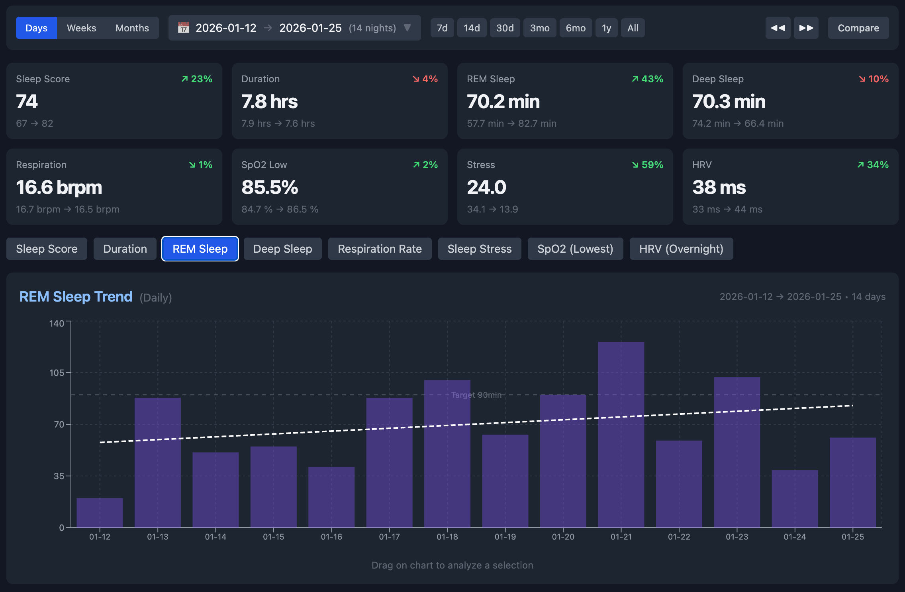
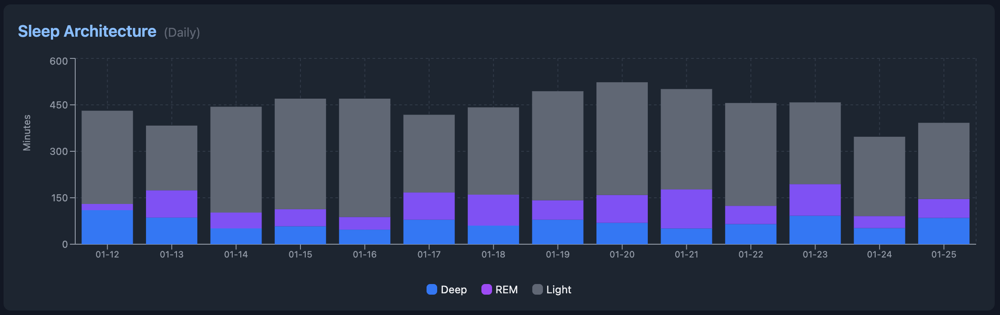
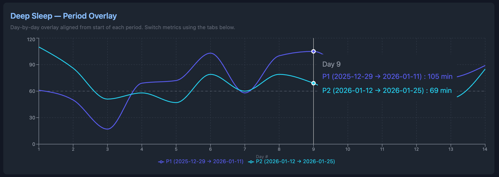
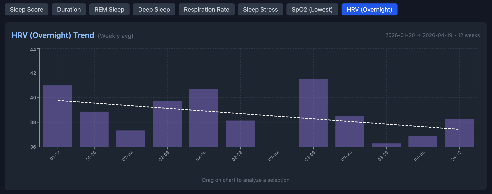

# Garmin Sleep

*A private, local-first sleep dashboard for your Garmin data — no cloud, no third-party accounts, your data never leaves your machine.*



## What it shows

- **Summary cards and trend charts** — sleep score, duration, REM, deep, respiration, SpO2, stress, HRV, resting heart rate. Each card carries a week-over-week delta.
- **Stage breakdown** — deep, REM, and light minutes stacked per night, so you can see composition change at a glance.
  
- **Compare any two periods** — drag-to-select on any chart, or pick two windows explicitly, and get a day-by-day overlay with summary deltas.
  
- **Days, weeks, or months** — toggle the granularity and every trend line recomputes against the selected window.
  

## How it works

The sync script authenticates to Garmin Connect with OAuth (via [garmy](https://github.com/bes-dev/garmy)), pulls daily health metrics into a local SQLite database, and closes the connection. A small Python stdlib `http.server` then serves a React single-page app from disk and exposes a read-only `/api/sleep` endpoint backed by the same SQLite file.

Everything lives on your machine. There is no hosted service, no telemetry, and no outbound traffic after the initial pull from Garmin.

```text
Garmin Connect  ──(OAuth)──►  garmy  ──►  sync.py  ──►  health.db  ──►  server.py  ──►  browser dashboard
```

## Install

Prerequisites: macOS or Linux, Python 3.10+. If your Garmin account has MFA enabled, the login step will prompt for the code.

```bash
git clone https://github.com/<you>/garmin-sleep.git
cd garmin-sleep
./setup-garmy.sh                                   # creates .venv, installs garmy, runs one-time Garmin login
.venv/bin/python sync.py 30                        # pulls the last 30 days of data
.venv/bin/python garmin-sleep-upgrade/server.py    # opens at http://localhost:8484
```

## Daily sync (optional)

- **Manual** — `.venv/bin/python sync.py` with no argument auto-detects how far behind you are (via `MAX(metric_date)` in the DB) and fetches only the gap.
- **Automatic, macOS only** — `./install-schedule.sh` installs a launchd agent at `~/Library/LaunchAgents/com.garmy.sync.plist` that runs every day at 7:00 AM. Stdout goes to `sync.log`, stderr to `sync-error.log`.

## Standalone mode (no sync, no server)

If you'd rather not hand credentials to anything, you can request a data export directly from Garmin (account settings → [Data Management](https://www.garmin.com/account/datamanagement/) → Sleep category), unzip it, and drag the JSON files into `garmin-sleep-upgrade/index.html` opened straight from disk in a browser. No Python, no network. See [`garmin-sleep-upgrade/README.md`](garmin-sleep-upgrade/README.md) for the expected JSON schema and drag-drop details.

## Privacy

Your sleep data stays on your machine. OAuth tokens are written to `~/.garmy/`, never to the repo. `health.db` is gitignored. The server binds to `localhost` and nothing phones home.

## FAQ

**Does this work on Linux and Windows?**
The dashboard and sync work anywhere Python runs. The scheduled auto-sync is macOS-only (launchd). On Linux use cron, on Windows use Task Scheduler — both pointing at `.venv/bin/python sync.py`.

**Does it support HRV?**
Yes. `hrv_last_night_avg`, `hrv_weekly_avg`, and `hrv_status` are pulled via the sync path and charted in the dashboard. HRV is *not* included in Garmin's own data export, so the standalone mode does not have it.

**Does it handle MFA?**
Yes. `login.py` uses garmy's default CLI prompt for MFA codes, and the dashboard's in-browser login flow hits `/api/auth/mfa` to resume the login after you enter the code.

**Can I run it for multiple Garmin accounts?**
Not today — `health.db` and `~/.garmy/` are single-user. If you need a second account, clone the repo to a second directory.

## Built on

[garmy](https://github.com/bes-dev/garmy), React, Recharts, Tailwind, Python stdlib `http.server`.

## License

MIT — see [LICENSE](LICENSE).
